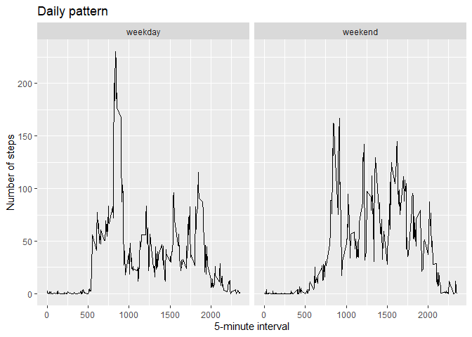

## Loading and preprocessing the data

```r
unzip("activity.zip")
data0<-read.csv("activity.csv")
data0$date<-as.Date(data0$date, "%Y-%m-%d")
```


## What is mean total number of steps taken per day?

*Before performing the analysis, I removed the missing data from the dataset. That's the way I interpreted the statement "For this part of the assignment, you can ignore the missing values in the dataset". If I simply set na.rm=T in the sum() function, I would obtain a bunch of days with a number of steps equal to 0, that is fairly impossible and in any case doesn't reflect the meaning of NAs.*

```r
if(!("dplyr" %in% installed.packages())) install.packages("dplyr")
library(dplyr)
data<-data0[!is.na(data0$steps),]
steps_day<-group_by(data, date) %>% summarise(total=sum(steps))
hist(steps_day$total, breaks = 10, xlab="Total steps per day", xlim=c(0,25000), main="Frequency of total steps per day")
avg<-mean(steps_day$total)
med<-median(steps_day$total)
abline(v=avg, col="green", lwd=2)
abline(v=med, col="blue", lwd=2)
legend("topright", lwd=2, col=c("green", "blue"), legend=c("Daily mean", "Daily median"))
```

<!-- -->

The **mean** total number of steps per day is **1.0766189\times 10^{4}**  
The **median** total number of steps per day is **10765**  
Those 2 numbers are very similar, but not identical:

```r
avg==med
```

```
## [1] FALSE
```


## What is the average daily activity pattern?

```r
avg_interval<-group_by(data, interval) %>% summarize(avg=mean(steps))
with(avg_interval, plot(interval, avg, type="l", main="Time series of average number of steps within a day", xlab="5-minute interval", ylab="Average number of steps"))
max_index<-which(avg_interval$avg==max(avg_interval$avg))
points(avg_interval[max_index,"interval"], max(avg_interval$avg), pch=23, bg="red", cex=2)
legend("topright",pch=23, pt.bg="red", pt.cex=2, legend="Max average number of steps")
```

<!-- -->


The **max average number of steps** in 5 minutes is **206** and it corresponds to interval number **835** (08:35)


## Imputing missing values

The number of **missing values** in the data set, calculated as follow, is **2304**, that corresponds to the **13.11%** of the measurements

```r
sum(is.na(data0$steps))
```

```
## [1] 2304
```

```r
round(sum(is.na(data0$steps))/nrow(data0)*100,2)
```

```
## [1] 13.11
```
As shown by the following code, there are 8 days with no data recorded during the 24 hours (knowing that there are 288 5-minute intervals in a day), which corresponds to the entire set of missing values:

```r
nas<-data0[is.na(data0$steps),]
group_by(nas, date) %>% summarize(number_of_NAs=n())
```

```
## # A tibble: 8 x 2
##   date       number_of_NAs
## * <date>             <int>
## 1 2012-10-01           288
## 2 2012-10-08           288
## 3 2012-11-01           288
## 4 2012-11-04           288
## 5 2012-11-09           288
## 6 2012-11-10           288
## 7 2012-11-14           288
## 8 2012-11-30           288
```
For this reason, any imputing strategy must be based on the values recorded during the other days. It seems reasonable to fill NAs with the mean or the median value for the corresponding interval. For convenience, we're using here the mean values that were calculated in a previous step of the assignment.  
Due to the particular distribution of NAs, their replacement can be done very easily as follows:

```r
data_filled<-data0
data_filled[data_filled$date %in% unique(nas$date),"steps"]<-avg_interval$avg
```
As shown by the following plot, this approach doesn't affect the values distribution, excepted for an increase of 8 units in the height of the central bin.


```r
steps_day1<-group_by(data_filled, date) %>% summarise(total=sum(steps))
hist(steps_day1$total, breaks = 10, xlab="Total steps per day", xlim=c(0,25000), ylim=c(0,25), main="Frequency of total steps per day WITH IMPUTED VALUES")
avg1<-mean(steps_day1$total)
med1<-median(steps_day1$total)
abline(v=avg1, col="green", lwd=2)
abline(v=med1, col="blue", lwd=2)
legend("topright", lwd=2, col=c("green", "blue"), legend=c("Daily mean", "Daily median"))
```

<!-- -->

The mean and the median values, that were already very similar, are now identical and they correspond the the total number of steps of the 8 days artificially imputed:


```r
avg1
```

[1] 10766.19

```r
med1
```

[1] 10766.19

```r
avg1==med1
```

[1] TRUE

```r
if(!("xtable" %in% installed.packages())) install.packages("xtable")
library(xtable)
xt<-xtable(head(steps_day1))
xt$date<-as.character(xt$date)

print(xt, type="html")
```

<!-- html table generated in R 4.0.2 by xtable 1.8-4 package -->
<!-- Thu Feb 25 15:47:19 2021 -->
<table border=1>
<tr> <th>  </th> <th> date </th> <th> total </th>  </tr>
  <tr> <td align="right"> 1 </td> <td align="right"> 2012-10-01 </td> <td align="right"> 10766.19 </td> </tr>
  <tr> <td align="right"> 2 </td> <td align="right"> 2012-10-02 </td> <td align="right"> 126.00 </td> </tr>
  <tr> <td align="right"> 3 </td> <td align="right"> 2012-10-03 </td> <td align="right"> 11352.00 </td> </tr>
  <tr> <td align="right"> 4 </td> <td align="right"> 2012-10-04 </td> <td align="right"> 12116.00 </td> </tr>
  <tr> <td align="right"> 5 </td> <td align="right"> 2012-10-05 </td> <td align="right"> 13294.00 </td> </tr>
  <tr> <td align="right"> 6 </td> <td align="right"> 2012-10-06 </td> <td align="right"> 15420.00 </td> </tr>
   </table>


## Are there differences in activity patterns between weekdays and weekends?

```r
data_filled$weekday<-weekdays(data_filled$date)
data_filled$wd<-as.factor(if_else(data_filled$weekday %in% c("Saturday", "Sunday"), "weekend", "weekday"))
int_av_wd<-group_by(data_filled,wd,interval) %>% summarize(avg=mean(steps))
```

```
## `summarise()` has grouped output by 'wd'. You can override using the `.groups` argument.
```

```r
if(!("ggplot2" %in% installed.packages())) install.packages("ggplot2")
library(ggplot2)
```

```
## Warning: package 'ggplot2' was built under R version 4.0.3
```

```r
qplot(interval, avg, data=int_av_wd, geom="line", xlab="5-minute interval", ylab="Number of steps", facets=.~wd, main="Daily pattern")
```

<!-- -->

During weekdays, there is a neat peak at around 7.30 AM, while, during the weekend, activity is more uniforme within the day (from 5.00 AM to 09.00 PM)
